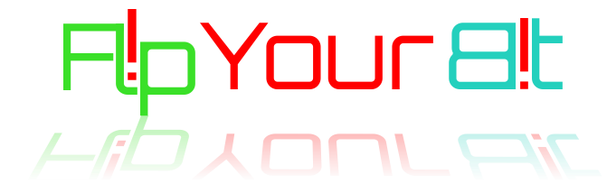

## EST: 2011

 > This is very much a work in progress

##  Supporting Preston Family and Friends  IT Operations

# Links
  

# Guides 
## [Family Computer Guides](../famguides.md)
## [General Guides](../guides.md)
## [ POP-OS Gaming](../gaming/POP_OS-Deployment.md)

# What we do
- Provide IT infrastructure to friends and family 
- Create  deployments for training
- Automation testing 
- Home automation testing 
- screw around in programing
- Support family and friends as an IT help desk 
- Run game servers for family and friends
- Sel fhost applications as a back up to cloud services
- basically we are the technology arm of a group of friends that started back in 2011

# The tools we use 
- proxmox 
- Hyper-V 
- k8s
- Argo CD
- Azure backups 
- Ansible
- Docker and Docker Compose 
- Ubuntu, Debian, Rocky Linux 
- AMP Game Panel 
- Netbox 
- Zabbix
- heimdall
- influxdb 
- Home assistant / Openhab 
- Geese for datacenter security and pest control

# The Active Tech Staff

| **Name** | **Github User** | **Discord** | **Facebook** |  **bluesky** | **Steam**  | **Role**| **picture** |
| :-----------| :---------- | -------- | :-------- | ------ |  -------- |-------- | --- |
| Stephen | smpreston162     | NA  | NA | NA   | NA | Platform Architect, Internet plumber | |

# Security and Pest control team 
| **Name** | **Github User** | **Discord** | **Facebook** |  **bluesky** | **Steam**  | **Role**| **picture** |
| :-----------| :---------- | -------- | :-------- | ------ |  -------- |-------- | --- |
| Horton  |   NA             | NA  | [FB](https://www.facebook.com/FeatheredFlotilla/) |NA| NA | Datacenter Security  Lead |  | 
| william  |   NA             | NA  | [FB](https://www.facebook.com/FeatheredFlotilla/) |NA|  NA | Datacenter Security Assistant Lead| | 
| Charlotte |   NA             | NA  | [FB](https://www.facebook.com/FeatheredFlotilla/) |NA| NA | Datacenter Security Guard | | 
| Fern  |   NA             | NA  | [FB](https://www.facebook.com/FeatheredFlotilla/) |NA|  NA | Datacenter Security Guard |  | 
| Abigail  |   NA             | NA  | [FB](https://www.facebook.com/FeatheredFlotilla/) |NA|  NA | Datacenter Security Guard | | 

# The Founders 
|  | |   |
|:---:|:---:|:--:|
|**smpreston162**  | **Mr.robQ** | **Camthelion** |           

